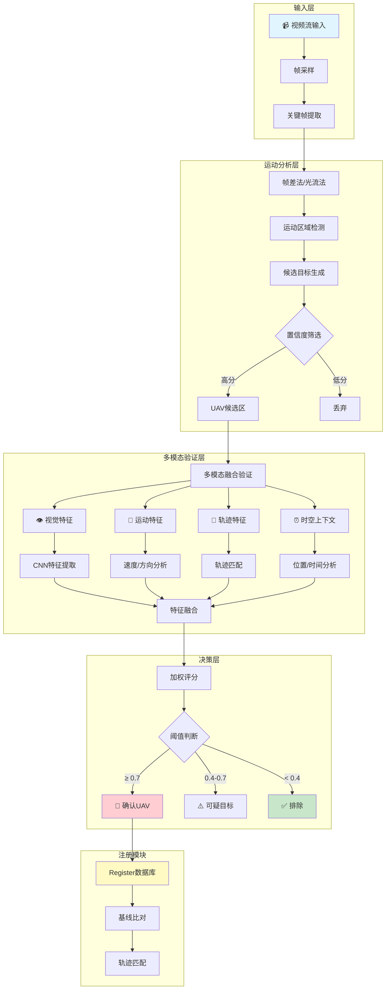
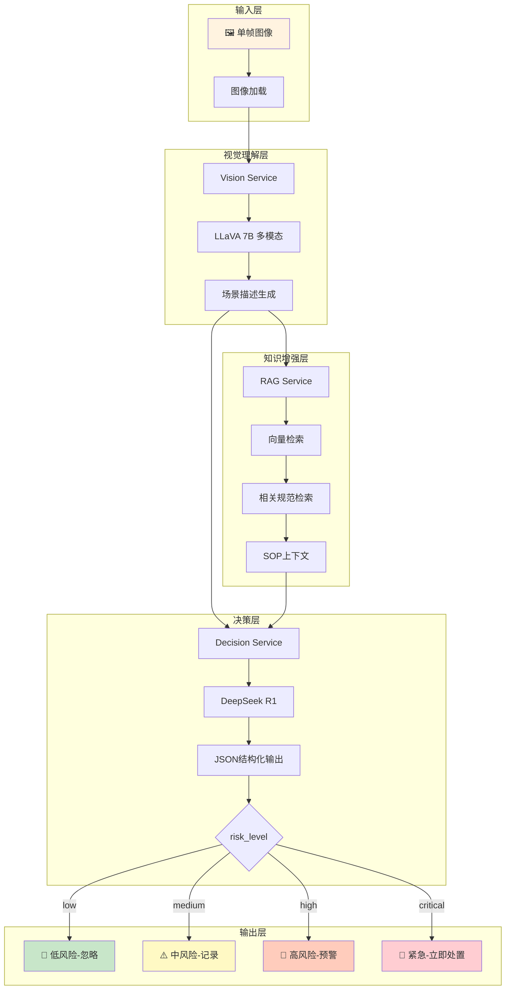

# 技术路线图对比

## SeeUnsafe 论文技术路线图

---

## 当前系统技术路线图

---

## 对比分析

| 维度 | SeeUnsafe | 当前系统 |
|------|-----------|----------|
| **输入** | 连续视频流 | 单帧图像 |
| **检测方式** | 运动分析 + 视觉验证 | 仅视觉理解 |
| **多模态** | ✅ 四维融合 | ❌ 单模态 |
| **Register** | ✅ 基线轨迹比对 | ❌ 无 |
| **实时性** | ✅ 15fps 实时 | ❌ LLM延迟高 |
| **误检控制** | ✅ 运动预筛 + 多模态验证 | ❌ 依赖LLM判断 |
| **轨迹跟踪** | ✅ 跨帧跟踪 | ❌ 无 |

## 关键差距

1. **缺少运动检测前置过滤** → 大量背景误检
2. **缺少多模态融合** → 纯视觉容易误判
3. **缺少时序分析** → 单帧无法判断运动状态
4. **缺少Register机制** → 无法识别已知UAV

